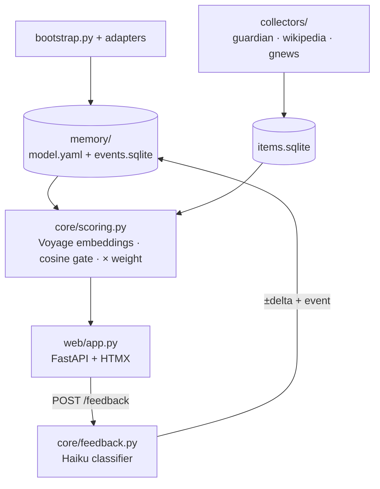

# Architecture — Srotas

The technical design of the prototype. Read [MISSION.md](MISSION.md) first for
goals, scope boundaries, and principles; read [ROADMAP.md](ROADMAP.md) for the
phased build order. Where this document and the scope boundaries in MISSION.md
§Scope boundaries disagree, the boundaries win.

## Component overview



Everything runs as **one process**: `uvicorn` serving the feed, with APScheduler
inside it driving collection every 4 hours. The memory package is a set of plain
files kept deliberately outside the code, because later stages will have Lumi
read it.

## Memory package

A separate directory, not part of the Srotas code:

```
memory/
  model.yaml          # the interest model (in git)
  events.sqlite       # the event journal — seed of a future Event Store
  pending_topics.yaml # queue of unconfirmed new topics (created at phase 0.5)
```

There is **no centroid cache** — centroids are recomputed each scoring pass
(see §Scoring).

**Node format** — flat, no graph, no decay:

```yaml
- id: artificial-life
  label: "Штучне життя"
  keywords: [artificial life, alife, cellular automata, emergence]
  weight: 0.8        # 0.05..1.0
```

`model.yaml` is hand-editable at any time; the system picks up changes on the
next scoring pass. It has **two writers** — the human (any time) and the code
(on a weight change). To keep it human-friendly, code writes it with
**ruamel.yaml** in round-trip mode, touching only the `weight` scalar and
leaving comments and formatting intact. Node labels are Ukrainian (they are
display data); everything else is code.

In git: `model.yaml` and `pending_topics.yaml` are tracked; `events.sqlite` is
runtime data and gitignored.

**Event journal:**

```sql
events(id, ts, kind,        -- bootstrap | feedback | weight_update
       node_id, payload)    -- payload: JSON with details
```

The schema stays intentionally minimal (MISSION §Scope boundaries, stage 2).
Every feedback and every weight change is appended here with the user's
original text, so any model change is traceable to a specific event.

## Item store

```sql
items(url PRIMARY KEY, source, title, summary,
      published_at, first_seen,
      embedding BLOB,      -- Voyage vector cache; computed once at collection
      score REAL, top_node TEXT)
```

Deduplication is by **URL** only — no simhash (that is stage 6). The embedding
cache is mandatory given the paid API: re-scoring after a weight change is then
instant and free. Changing the embedding model means resetting the `embedding`
column.

`published_at` is **nullable** — not every source dates its items (Wikipedia
articles have no publication date); wherever a day matters (feed grouping), the
fallback is `first_seen`. Both SQLite databases run in **WAL mode**: the
scheduler thread and web requests share them within the one process.

## Collectors

Each node turns into search queries built from its `keywords`. Every
collector's output is normalized into an `Item`.

- **The Guardian** — Open Platform API, free developer key:
  `content.guardianapis.com/search?q=...` → title, trailText, webUrl,
  webPublicationDate. **One request per node** (keywords joined with OR), not
  one per keyword: at 14 nodes × ~7 keywords × 6 cycles/day, per-keyword would
  exceed the free tier (500/day); per-node OR gives ~84 calls/day.
- **Wikipedia** — REST API: article search by keywords + the daily featured
  feed. Items carry no `published_at`; the feed day falls back to `first_seen`.
- **Google News RSS** —
  `news.google.com/rss/search?q=...&hl=en-US&gl=US&ceid=US:en` — English locale
  only. **One OR-joined request per node**, same strategy as Guardian:
  per-keyword would mean ~590 unauthenticated requests/day and invite Google
  rate-limiting; per-node is ~84. This is the Discover replacement; there is no
  public API to a personal Google feed.

**Scheduler:** APScheduler inside the app process, collection every 4 hours
(interval in config). Each collection cycle runs collect → embed new items →
score.

## Scoring

Single stage, no LLM:

1. Item embedding: `title + ". " + summary`.
2. Node centroid: the mean vector of its keywords — recomputed on the fly each
   scoring pass. The computation is cheap, and a separate cache would risk going
   stale after a hand-edit of `model.yaml`.
3. **Relevance gate:** an item is eligible for a node when
   `cosine(item, centroid) ≥ threshold` (0.35 start, in config; calibrated
   against the CLI preview at phase 0.3). The threshold applies to the **pure
   cosine**, never to the weighted score. Weight must not decide existence,
   only rank: cosine ≤ 1, so a node with weight below the threshold would be
   mathematically unable to ever surface an item — and since weights grow only
   through likes on visible items, it could never recover. A death spiral for
   the weak half of the model, prevented by gating on cosine alone.
4. **Ranking:** `score(item) = max over eligible nodes (cosine(item, centroid)
   × weight(node))`; the argmax node is stored as `top_node` — the "why
   suggested." Weight is priority in the feed, not the right to exist.

**Embedding model: voyage-3 (Voyage AI API)** — the same model as Lumi's RAG,
so Srotas items and Lumi memory vectors share one space (MISSION §Relationship
to Lumi). The call is a direct HTTP POST via httpx
(`api.voyageai.com/v1/embeddings`), `input_type=document` for items and `query`
for centroids; key `VOYAGE_API_KEY` in config. Cost is negligible (~$0.06 / 1M
tokens — cents per month). There is no local model at all — no
sentence-transformers, no torch. The only network in scoring is the embedding
call; there are no LLM calls in scoring.

## Feed

FastAPI + HTMX, one screen. Cards sorted by descending score within a day,
fresh days on top; a feed day is `date(published_at)`, falling back to
`first_seen` for undated sources. A card shows: title link, source, date,
score, node tag (the reason), and a feedback text field.

The app binds to **127.0.0.1 only** — it exposes an unauthenticated POST that
spends money (Haiku) and mutates the model; it must never listen on an external
interface in the prototype.

The node tag on a card is **clickable**: clicking filters the feed to that
node; an "all" link resets the filter. There is no separate filter-button panel
and no period toggle — filtering lives in the cards themselves.

## Feedback

A text field per card → `POST /feedback` → one Haiku-class LLM call classifies
the text:

```json
{ "reaction": "like | dislike | new_topic",
  "topic_hint": "name + keywords, if new_topic" }
```

The classifier receives the **card's context** (item title + `top_node`)
alongside the user's text — "more like this" is unclassifiable without knowing
what "this" is; only the structured reaction comes back.

**Weight update:** the delta applies to the **card's `top_node`**. like +0.05,
dislike −0.07, clamped to [0.05, 1.0]; deltas in config. The asymmetry is
deliberate: a negative signal is more informative, and it guards against weight
inflation; the lower clamp of 0.05 means a node never dies completely. Each
feedback and each weight change is written to `events` with the user's original
text, and the payload carries the item URL — the trace runs feedback → node →
item. After an update the feed is re-scored (free — embeddings are cached) so
it reorders immediately.

`new_topic` does **not** create a node automatically — it lands in the
`pending_topics.yaml` queue for manual confirmation, because the classifier
makes mistakes and a new node immediately affects collection (new collector
queries). Confirmation is a hand edit: the user moves the topic into
`model.yaml` themselves; there is no code path or UI for it.

## Bootstrap

A two-stage story. The **initial model** already exists; the **full bootstrap**
is the last roadmap phase (0.7).

### Initial model from Lumi facts

Besides raw messages, Lumi's `store.json` has a `facts` layer — ~1300
non-obsolete short facts about the user, already distilled by Lumi. A one-off
Haiku clustering of those facts produced 12–18 candidate topics (id, label,
English keywords, starting weight, a likely-work flag) → manual review → the
initial `model.yaml`. This is orders of magnitude cheaper than a full
extraction and replaces the "temporary 3-node hand model" idea: the skeleton is
developed on a real interest model from the start. The candidates were prepared
during spec agreement (2026-07-04, [model-candidates.yaml](model-candidates.yaml),
14 reviewed nodes); creating the memory package records the model's provenance
as a bootstrap event.

### Full bootstrap (phase 0.7)

`bootstrap.py` + adapters read four sources, all snapshot-based, never live:

| Source | What is taken | Access |
|---|---|---|
| Lili conversations — **primary** | `role=user` messages only (the facts / summaries / thoughts layers are not used here) | Snapshot of `lumi/.lumi/store.json`: a hand copy (`cp`) into `bootstrap/snapshots/` before running bootstrap; that directory is gitignored (private conversations). The snapshot path is a CLI argument; its path and date are recorded in the bootstrap event |
| Claude export | Conversation text | Settings → Privacy → Export data (web/Desktop); the archive with `conversations.json` arrives by email, the link lasts 24h; deleted conversations are not included |
| Browser history | Domains, titles, repeat visits | Chrome: the `History` file in the profile; Firefox: `places.sqlite`. Both are locked while the browser runs — work off a copy in `bootstrap/snapshots/` |
| Notion — whole base | Pages, databases, titles, tags | A one-off Markdown export of the workspace (Settings → Export); the adapter reads the export files. The Notion API is rejected — extra code and a token for a one-off procedure |

**Procedure:** `bootstrap.py` reads the sources → an LLM pass extracts
candidate topics with keywords in chunks (simplified — no windows or citation
validation, that is stage 2) → merge duplicates → **manual review of the
candidate list** before writing `model.yaml` → a final model of 10–15 nodes.
Work topics (projects, clients) are cut at review; a topic blacklist in config
keeps collectors away from them.

## Configuration

`config.toml` holds API keys (Guardian, Voyage, Anthropic), the cutoff
threshold, the collection interval, the weight deltas, and the topic blacklist.
It is read with the stdlib `tomllib` (no write path — the file is hand-edited).
It is gitignored; a committed `config.example.toml` documents the shape.

## Repository layout

```
srotas/
  memory/            # memory package — separate from the code
  bootstrap/         # bootstrap.py + adapters: lumi_snapshot.py,
                     #   claude_export.py, browser_history.py, notion.py
                     # bootstrap/snapshots/ — store.json snapshots, gitignored
  collectors/        # guardian.py, wikipedia.py, gnews.py
  core/              # model.py, events.py, items.py, scoring.py, feedback.py, config.py
  web/               # app.py, templates/
  tests/             # pytest — mocks for paid/network calls
  spec/              # MISSION / ARCHITECTURE / ROADMAP / vision + model-candidates.yaml
                     # spec/roadmap/implementation/ — vA.B-issues.md + upload/execution reports
  .claude/skills/    # generate-issues, upload-issues, execute-issues, release-version
  config.toml        # API keys, threshold, interval, deltas, topic blacklist (gitignored)
  VERSION            # created by /release-version at the first release
  RELEASE.txt        # created by /release-version at the first release
```

One process: uvicorn with APScheduler inside. Python 3.12. Dependencies:
fastapi, uvicorn, httpx, feedparser, apscheduler, ruamel.yaml, anthropic. Dev
dependencies: pytest, ruff. No sentence-transformers, no torch — embeddings go
through the Voyage API. ruamel.yaml rather than pyyaml because `model.yaml`
needs a round-trip write that preserves comments.

## Contracts that must not drift

These are the seams the whole prototype leans on; keep them stable, and pin
each with a test:

- **Node format is flat** — `id`, `label`, `keywords`, `weight`, nothing else.
  No kind/tier/half_life/related, no graph, no decay (MISSION §Scope
  boundaries).
- **Events schema is minimal** — `(id, ts, kind, node_id, payload)`,
  `kind ∈ {bootstrap, feedback, weight_update}`. Do not extend it.
- **The memory package is code-independent** — plain files in `memory/`; no
  memory API endpoints, no imports from Lumi/kiln. A later stage reads these
  files; the prototype only writes them.
- **No LLM in scoring** — the only LLM calls are feedback classification and
  bootstrap extraction. Scoring's only network is the Voyage embedding call.
- **The relevance gate is cosine-only** — the cutoff threshold never applies to
  the weighted score; weight ranks, it does not decide existence.
- **Model changes are traceable** — every weight change has a matching `events`
  row carrying the user's original text.
- **Lumi data is snapshot-only** — read from hand-copied files, never a live
  connection.

## Testing & CI

Every phase ships with pytest tests encoding its DoD (see
[ROADMAP.md](ROADMAP.md)). Following Lumi's convention: **all paid APIs
(Voyage, Anthropic) and all collector network calls (Guardian / Wikipedia /
GNews) are mocked — nothing paid or networked runs in CI.** A mock embedder
returns fixed vectors; a mock classifier returns canned (and deliberately
malformed) structured replies so the validation path is exercised. Changing a
contract above changes its test. Lint gate: `ruff check` (and `ruff format
--check`) alongside pytest. `main` stays green.
